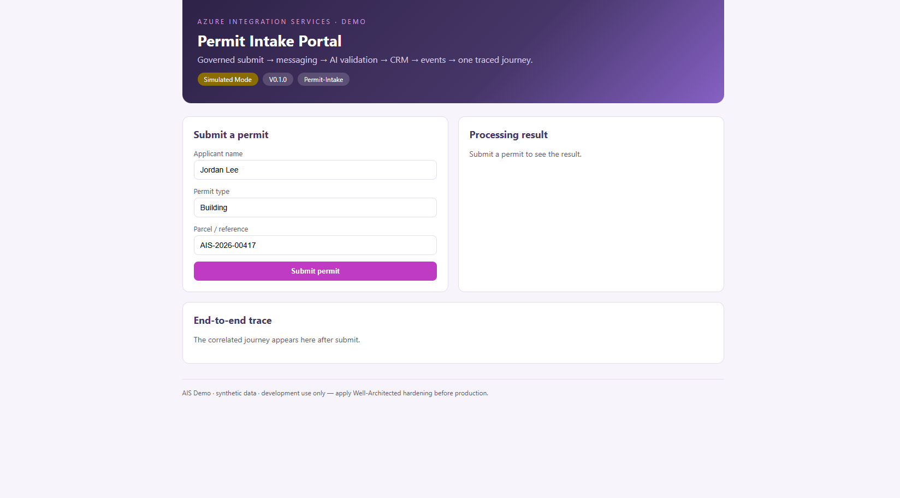
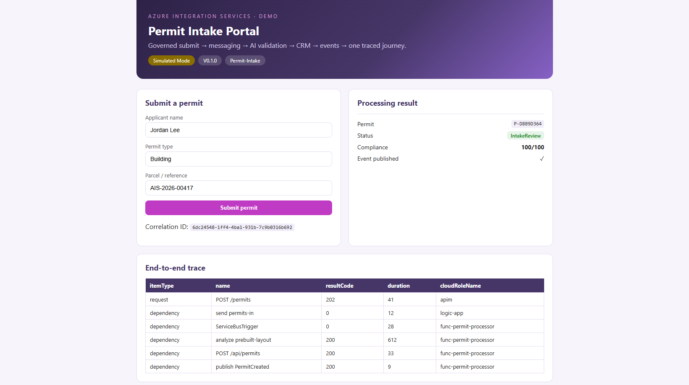
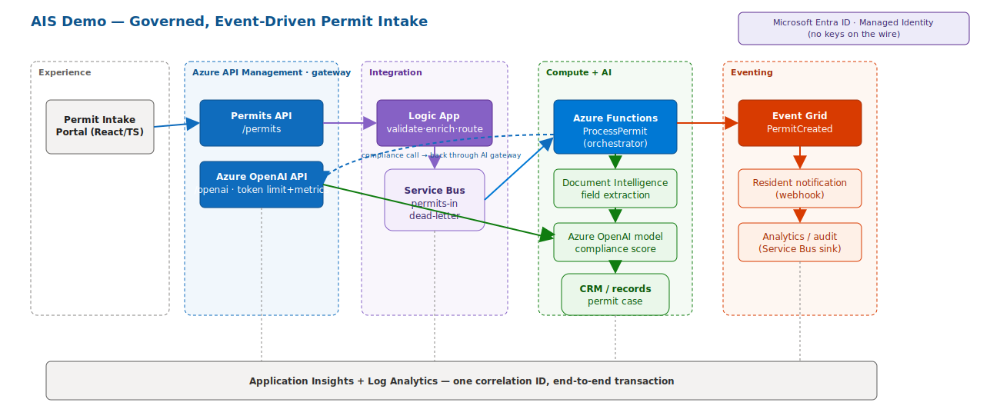

# AIS Demo — Governed, Event-Driven Permit Intake

> An **Azure Integration Services** customer demo. It shows one governed,
> event-driven flow **two ways** — a click-through in the **Azure Portal** and
> the **Azure SDK for Python** — so the room sees the same story from both a
> business and an engineering perspective.

The reference scenario is a citizen **permit request**, but the codebase is
**generic, modular, and reproducible**: swap the schemas and `USE_CASE_PROFILE`
to adapt the same pattern to any intake use case. All data is synthetic.

> [!WARNING]
> **Development / proof-of-concept use only.** This project does not implement
> the security hardening, networking isolation, or operational controls
> required for production. Before deploying, follow the
> [Azure Well-Architected Framework](https://learn.microsoft.com/azure/well-architected/).

## The portal

The React portal is a stand-in for a public permit site. Submit a permit and it
shows the governed journey end to end — the compliance score from the AI gateway
and the correlated trace across every Azure service.

| Submit | Result + end-to-end trace |
| --- | --- |
|  |  |

*Left: submit a permit. Right: the processing result (permit ID, `IntakeReview`
status, 100/100 compliance, event published) and the correlated hop-by-hop trace
(APIM → Logic App → Service Bus → Function → Event Grid).*

## What it demonstrates

| Capability | Azure service |
| --- | --- |
| Governed, secured APIs (Entra JWT + rate limiting + correlation ID) | **API Management** |
| AI-gateway cost control (token limits + per-team token metrics) | **API Management** (AI gateway) |
| Low-code orchestration (validate → enrich → route) | **Logic Apps** |
| Reliable async messaging with dead-lettering | **Service Bus** |
| AI field extraction | **Azure AI Document Intelligence** |
| AI policy-compliance scoring | **Azure OpenAI** (fronted by APIM) |
| Event-driven fan-out (decoupled subscribers) | **Event Grid** |
| Serverless processing | **Azure Functions** |
| End-to-end distributed tracing | **Application Insights** |

```
Portal → API Management → Logic App → Service Bus → Function/AI agent → CRM → Event Grid → Notification
```



See [docs/architecture.md](docs/architecture.md) for diagrams (editable draw.io
sources in [docs/diagrams/](docs/diagrams/)).

## Tech stack

- **Python 3.11+**, `src/` layout, managed with **uv**
- **FastAPI** orchestrator + **Azure Functions** host (Service Bus trigger) — both reuse `src/ais_demo`
- Latest stable Azure SDKs: `azure-identity`, `azure-servicebus`,
  `azure-ai-documentintelligence`, `azure-eventgrid`,
  `azure-monitor-query`, `openai`
- **React 18 + TypeScript + Vite** portal
- **Bicep** IaC · **pytest**, **ruff**, **mypy**
- **Simulated mode** so the whole demo runs offline with no Azure credentials

## Quickstart (no Azure required)

```bash
# 1. Install uv — https://docs.astral.sh/uv/
# 2. Sync dependencies (creates .venv)
uv sync --extra dev

# 3. Configure environment (SIMULATED_MODE=true by default)
cp .env.example .env

# 4. Run the Part B (Python SDK) walkthrough end to end — steps B1-B8
uv run ais-demo
```

Run the API + portal together:

```bash
./scripts/setup.sh       # syncs Python + frontend deps, creates .env
./scripts/app.sh start    # start API (:8000) + portal (:5173) in the background
./scripts/app.sh status   # show what's running
./scripts/app.sh stop      # stop both
```

(`./scripts/run_local.sh` runs both in the foreground instead.)

- Portal: <http://localhost:5173>
- API: <http://localhost:8000>  ·  Swagger: <http://localhost:8000/docs>

Rehearse both governed front doors against live Azure (after deploy):

```bash
./scripts/run_demo.sh        # Part A (APIM → Logic App) + Part B (APIM direct) + AI gateway
```

## Repository layout

```
src/ais_demo/     Shared package: orchestrator + integrations + FastAPI + Part B driver (see its README)
functionapp/      Azure Functions host (Service Bus trigger) — reuses src/ais_demo
ai_demo/          AI-gateway feature demos: per-user cost attribution, model routing, gateway calls
apim/policies/    APIM AI-gateway + front-door policies (direct enqueue + Logic App routing)
infra/            Bicep IaC (Service Bus, Event Grid, Document Intelligence, AOAI, Functions, APIM, Logic App)
integration/      Low-code artifacts: Logic App workflow + Event Grid subscriptions
frontend/         React + TypeScript portal
data/             Synthetic samples + demo prompts
scripts/          app (start/stop) · run_demo · setup · seed helpers
tests/            pytest suite (health, permits, orchestrator, resilience)
docs/             architecture · Demo Track · deployment · production path
```

### Directory guides

Each major directory has its own README:

- [src/ais_demo/README.md](src/ais_demo/README.md) — shared package: orchestrator + integration adapters + FastAPI
- [functionapp/README.md](functionapp/README.md) — Azure Functions host (Service Bus-triggered permit processor)
- [frontend/README.md](frontend/README.md) — React + TypeScript Permit Intake Portal
- [integration/README.md](integration/README.md) — low-code Logic App workflow + Event Grid subscriptions
- [scripts/README.md](scripts/README.md) — setup, start/stop, and demo-rehearsal scripts

## The demo, two ways

- **Part A — Azure Portal:** a click-through of every hop (governance,
  messaging, AI validation, eventing, tracing, failure paths). See
  [docs/demo-track.md](docs/demo-track.md), steps A1–A15.
- **Part B — Azure SDK for Python:** the same flow in code (`uv run ais-demo`),
  steps B1–B8.

## Adapt to another use case

1. Edit the schemas in [src/ais_demo/schemas/permit.py](src/ais_demo/schemas/permit.py).
2. Adjust extraction/validation in `src/ais_demo/integrations/`.
3. Set `USE_CASE_PROFILE` and update the synthetic samples in `data/`.

The integration topology (APIM → Logic App → Service Bus → Function → Event
Grid) stays the same.

## Deploy to Azure

See [docs/deployment-guide.md](docs/deployment-guide.md) — Bicep or `azd up`,
plus the RBAC and switch-to-live steps.

For the full **path to production** (security, reliability, observability,
evaluation, CI/CD) mapped to the Well-Architected Framework and Microsoft
reference architectures, see [docs/production-path.md](docs/production-path.md).

## License

[MIT](LICENSE). Synthetic data only; no compliance claims.
