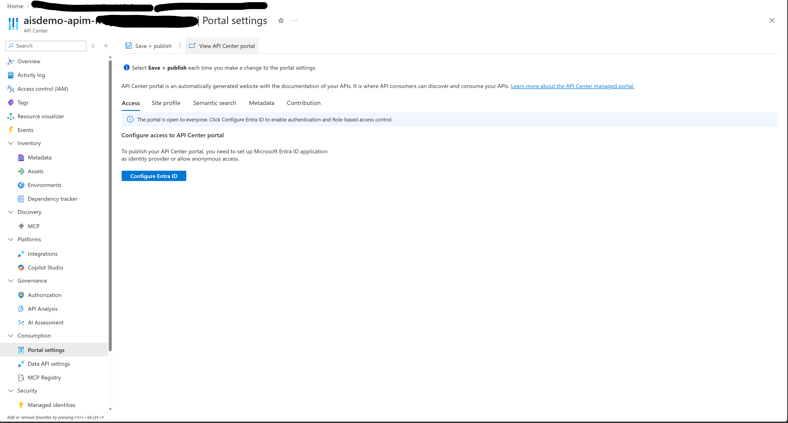
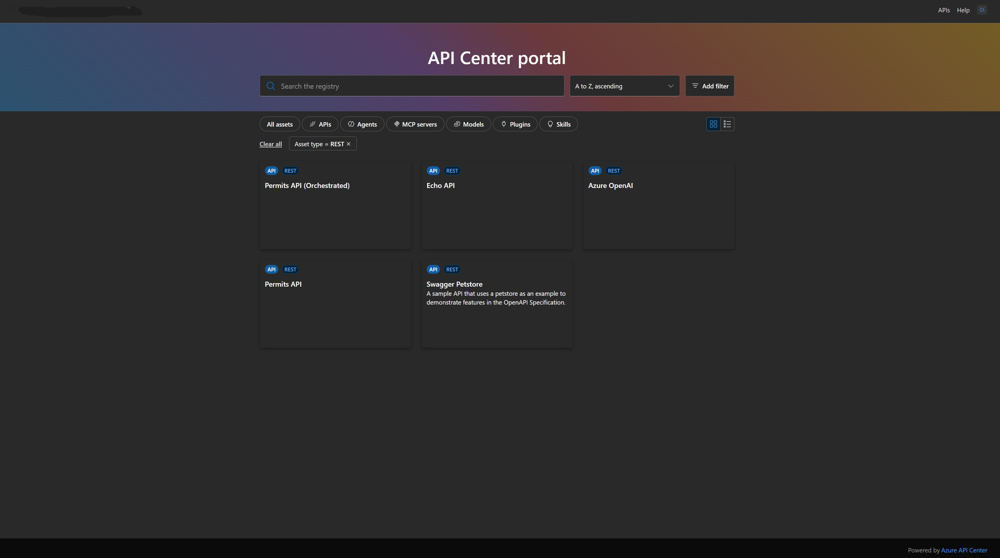
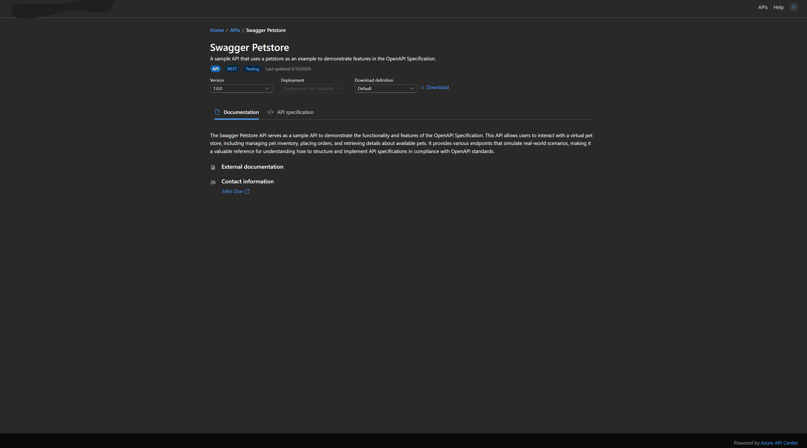

# API Center portal — AIS demo

The Azure API Center portal gives developers one searchable catalog for the
APIs used by this demo. It complements API Management: API Center supports
discovery, documentation, and reuse, while API Management governs runtime
traffic, authentication, quotas, policies, and observability.

This guide describes the portal configuration and the expected developer
experience for the permit-intake example.

## Demo catalog

The API Center linked to the demo API Management instance contains these APIs:

| API | Purpose | Expected lifecycle |
| --- | --- | --- |
| **Permits API** | Accepts permit requests through the direct governed path | Development |
| **Permits API (Orchestrated)** | Accepts permit requests routed through the Logic App workflow | Development |
| **Azure OpenAI** | Exposes the governed model endpoint used for compliance scoring | Development |

The synchronized APIM catalog can also contain the built-in **Echo API**. A
new API Center can include **Swagger Petstore** as sample content. These sample
APIs are useful for comparison, but they are not part of the permit workflow.

## Configure and publish the portal

In the Azure portal, open the API Center resource and select **Consumption >
Portal settings**.



*API Center portal settings before Entra ID access is configured. Publish every
settings change with **Save + publish**.*

The **Access** tab is the starting state shown in the first screenshot. Choose
one access model:

1. Select **Configure Entra ID** for authenticated organizational access. This
   is the recommended option.
2. Let API Center create the single-tenant app registration, or supply an
   existing compatible registration.
3. Assign portal users or groups the **Azure API Center Data Reader** role,
   scoped to this API Center resource.
4. Select **Save + publish**. Portal setting changes do not become visible until
   they are published.

Anonymous access is available, but it makes discoverable API information
public to anyone with the portal URL. Do not use it for internal API catalogs.

> The API Center system-assigned managed identity is for service-to-service
> access. Human portal users still authenticate interactively through Microsoft
> Entra ID and need the API Center data-plane role.

Optional settings on the remaining tabs include:

- **Site profile** — set the portal name shown in the top navigation.
- **Semantic search** — enable natural-language discovery on the Standard plan.
- **Metadata** — expose selected governance metadata on API details.
- **Contribution** — link a Git repository where developers can propose
  catalog changes.

## What developers see

After publishing, select **View API Center portal**. With Entra ID configured,
the landing page is reachable but API content appears only after the user signs
in.

### Catalog view

The second screenshot shows the signed-in catalog as a grid of assets. For this
demo, a developer can:



*The published AIS demo catalog filtered to REST APIs. API Center provides the
discovery experience across APIs while API Management governs runtime calls.*

- Select **APIs** or filter to `Asset type = REST`.
- Search for `permit` to find both permit entry points.
- Search for `OpenAI` to find the governed model API.
- Switch between grid and list layouts.
- Open an API card to inspect its versions, deployments, and definition.

For a customer presentation, show **Permits API (Orchestrated)** first. It
connects API discovery to the complete integration journey:

```text
Portal -> API Management -> Logic Apps -> Service Bus -> Azure Functions
       -> Document Intelligence -> APIM AI gateway -> Azure OpenAI
       -> CRM -> Event Grid
```

Then open **Azure OpenAI** to explain that the model endpoint is cataloged like
other APIs but remains governed by API Management policies for token limits,
metrics, and managed-identity backend authentication.

### API documentation view

The third screenshot shows the Swagger Petstore detail page. An AIS demo API
uses the same layout:



*The sample API detail experience. A registered AIS OpenAPI definition uses the
same documentation and specification layout.*

- **Title and summary** identify the API and its business purpose.
- **Kind and lifecycle badges** show values such as `API`, `REST`, and
  `Development`.
- **Version** selects the registered contract version.
- **Deployment** identifies an available runtime environment and endpoint.
- **Download definition** exports the selected OpenAPI definition.
- **Documentation** presents the API description, external documentation, and
  contact information.
- **API specification** renders operations, parameters, request bodies, and
  responses from the OpenAPI document.

For **Permits API (Orchestrated)**, the documentation should read similarly to:

> Accepts a synthetic permit application through the governed orchestration
> path. API Management validates and correlates the request, Logic Apps
> validates and routes it, Service Bus provides durable delivery, and the
> permit processor extracts fields, scores compliance, records the permit, and
> publishes a `PermitCreated` event.

Recommended API metadata:

| Field | Demo value |
| --- | --- |
| Summary | Governed, asynchronous permit-intake API |
| Lifecycle | Development |
| Kind | REST |
| Version | `1.0.0` |
| Definition format | OpenAPI 3.x |
| Contact | Demo API owners or platform team |
| External documentation | This repository's architecture and demo-track documentation |

An API imported from API Management might initially show only its title and
basic metadata. Register or synchronize an OpenAPI definition to populate the
**API specification** experience. Add a deployment and environment when users
need to discover the runtime endpoint or use the portal test console.

## Visual Studio Code portal view

The Azure API Center extension gives developers a catalog view without granting
Azure portal management access.

### Administrator setup

Use the same Entra app registration as the managed portal. In its
**Authentication** settings, add the documented mobile and desktop redirect
URIs:

```text
https://vscode.dev/redirect
http://localhost
ms-appx-web://Microsoft.AAD.BrokerPlugin/<application-client-id>
```

Developers also need **Azure API Center Data Reader** on the API Center.

### Developer connection

1. Install the **Azure API Center** extension for Visual Studio Code.
2. Run **Azure API Center: Connect to an API Center** from the Command Palette.
3. Enter the data-plane runtime host, without `https://`:

   ```text
   <service-name>.data.<region>.azure-apicenter.ms
   ```

4. Enter the portal app registration's application (client) ID and directory
   (tenant) ID.
5. Select **Sign in to Azure**, then expand **APIs** to browse versions and
   definitions.

From a definition, developers can export the specification, generate Markdown,
open OpenAPI documentation, or use the optional Kiota extension to generate an
API client.

## Demo walkthrough

Use this short sequence during Demo Track step A2:

1. Open **Portal settings** and point out Entra ID access and **Save + publish**.
2. Open the API Center portal and filter to REST APIs.
3. Select **Permits API (Orchestrated)**.
4. Show its version, deployment, documentation, and OpenAPI specification.
5. Return to the catalog and open **Azure OpenAI**.
6. Transition to API Management to show how the discovered APIs are governed at
   runtime.

## Troubleshooting

| Symptom | Check |
| --- | --- |
| Portal asks users to sign in | Expected with Entra ID access; complete interactive sign-in |
| User is not authorized | Assign **Azure API Center Data Reader** at the API Center scope |
| Sign-in does not complete | Verify the SPA redirect URI exactly matches the portal URL |
| VS Code cannot sign in | Verify client ID, tenant ID, runtime host, and desktop redirect URIs |
| API card has little documentation | Register or synchronize an OpenAPI definition and enrich API metadata |
| Portal changes are missing | Return to **Portal settings** and select **Save + publish** |

## Microsoft documentation

- [Set Up the API Center Portal — Azure API Center](https://learn.microsoft.com/en-us/azure/api-center/set-up-api-center-portal)
- [Enable API Center portal view — Azure API Center VS Code extension](https://learn.microsoft.com/en-us/azure/api-center/enable-api-center-portal-vs-code-extension)
