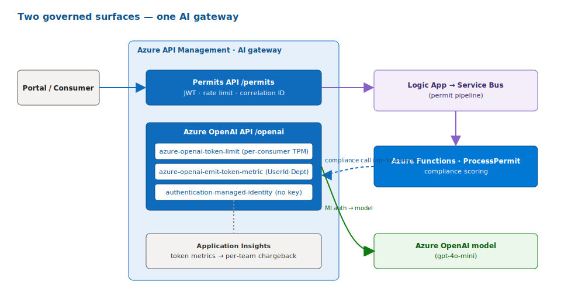
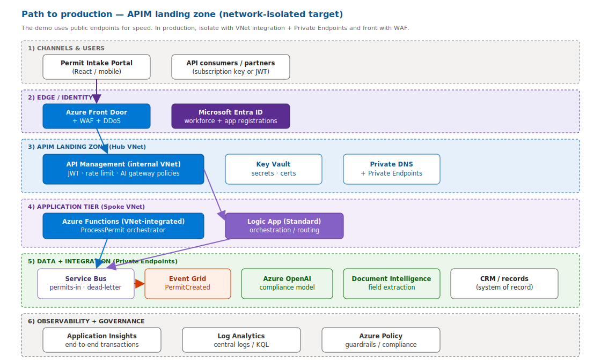

# Architecture

A governed, event-driven **intake** flow built on Azure Integration Services.
The reference use case is a citizen **permit request**, but the pattern is
generic — swap the schemas and `USE_CASE_PROFILE` to fit any intake scenario.

## Flow


<sub>Rendered from a draw.io source kept locally (the editable `.drawio` files are not committed).</sub>

## Two governed API surfaces

API Management governs **both** the public API and the model API:



<sub>Rendered from a draw.io source kept locally (not committed).</sub>

The Function's compliance-scoring call (step B4) routes **back through** the
APIM Azure OpenAI surface, so `azure-openai-token-limit` and
`azure-openai-emit-token-metric` apply to every model call — that is the
per-team AI chargeback signal.

## What the demo proves

| Capability | Where | Demo Track step |
| --- | --- | --- |
| Governed, secured APIs (Entra JWT + rate limiting) | API Management | A4, A6, A14 / B1 |
| AI-gateway cost control (token limits + metrics) | API Management | A5 / B4 |
| Reliable async messaging + dead-letter | Service Bus | A8, A15 / B2, B7 |
| AI extraction + validation + compliance score | Document Intelligence + AOAI | A9, A10 / B3, B4 |
| Event-driven fan-out (decoupled subscribers) | Event Grid | A12 / B6 |
| One correlation ID, end-to-end trace | Application Insights | A13 / B8 |

## Correlation

A single correlation ID is created at API Management and propagated through the
Logic App, Service Bus message properties, the Function, the CRM write, and the
Event Grid event. In Application Insights it renders as one end-to-end
transaction; from Python the same trace is returned by a Kusto query
(`GET /api/trace/{correlationId}` or step B8).

## Path to production (APIM landing zone)

The demo uses **public endpoints** for speed. For production, isolate the same
services behind a network-hardened **APIM landing zone** — VNet-integrated APIM,
WAF at the edge, and Private Endpoints for the data + integration tier — aligned
with the [Azure APIM landing zone reference](https://learn.microsoft.com/azure/architecture/example-scenario/integration/app-gateway-internal-api-management-function#architecture).



<sub>Rendered from a draw.io source kept locally (not committed). Apply the [Well-Architected Framework](https://learn.microsoft.com/azure/well-architected/) before production.</sub>

For the full production checklist — security, reliability, observability,
evaluation, and CI/CD, mapped to WAF pillars and Microsoft reference
architectures — see [production-path.md](production-path.md).

## Repository layout

```
.
├── src/ais_demo/            # Shared application package (orchestrator + integrations)
│   ├── api/                 #   FastAPI host (governed backend)
│   ├── integrations/        #   APIM, Service Bus, Document Intelligence, AOAI, Event Grid, CRM, Monitor
│   ├── orchestrator.py      #   Function/AI-agent core: extract → validate → CRM → event
│   ├── schemas/             #   Pydantic models
│   ├── core/                #   correlation, logging, errors
│   ├── config/              #   pydantic-settings
│   └── demo/                #   Part B (B1-B8) runnable driver
├── functionapp/             # Azure Functions host (Service Bus trigger) — reuses src/ais_demo
├── apim/policies/           # APIM AI-gateway + front-door policy samples
├── infra/                   # Bicep IaC (monitoring, identity, Service Bus, Event Grid, DI, AOAI, Functions, APIM)
├── integration/             # Low-code artifacts: Logic App workflow + Event Grid subscriptions
├── frontend/                # React + TypeScript portal
├── data/                    # Synthetic samples + demo prompts
├── scripts/                 # Setup / run / seed helpers
├── tests/                   # pytest suite
└── docs/                    # This document + Demo Track + deployment guide
```
