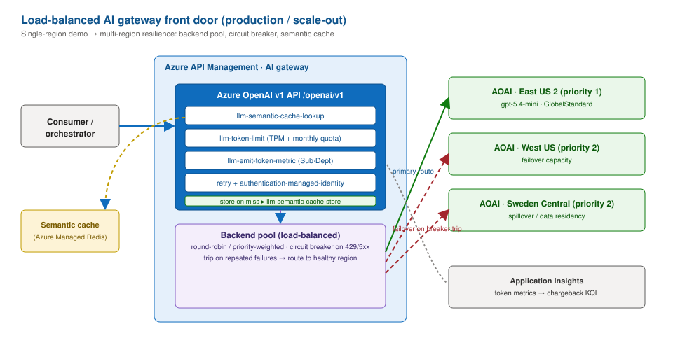

# Production path

This demo is a **proof of concept**: it favors clarity and speed (public
endpoints, simple SKUs, simulated fallbacks). This document is the reference for
taking the same architecture to **production** — what to add, why, and where it
maps in this repo — organized by the
[Azure Well-Architected Framework (WAF)](https://learn.microsoft.com/azure/well-architected/)
pillars and aligned to Microsoft reference architectures.

> [!IMPORTANT]
> Nothing here is a compliance claim. Treat this as a checklist to plan a
> production rollout with your security, platform, and data teams.

## Reference architectures (Microsoft guidance)

| Topic | Reference |
| --- | --- |
| API gateway + internal APIM + Functions | [Protect APIs with Application Gateway + API Management](https://learn.microsoft.com/azure/architecture/example-scenario/integration/app-gateway-internal-api-management-function#architecture) |
| APIM landing zone accelerator | [API Management landing zone accelerator](https://learn.microsoft.com/azure/cloud-adoption-framework/scenarios/app-platform/api-management/landing-zone-accelerator) |
| Generative AI gateway (token limits, metrics, safety) | [AI gateway in API Management](https://learn.microsoft.com/azure/api-management/genai-gateway-capabilities) · [`llm-emit-token-metric`](https://learn.microsoft.com/azure/api-management/llm-emit-token-metric-policy) · [GenAI gateway guidance](https://learn.microsoft.com/ai/playbook/technology-guidance/generative-ai/dev-starters/genai-gateway/) |
| Event-driven / messaging | [Event-driven architecture style](https://learn.microsoft.com/azure/architecture/guide/architecture-styles/event-driven) · [Asynchronous messaging options](https://learn.microsoft.com/azure/architecture/guide/technology-choices/messaging) |
| Serverless event processing | [Serverless event processing](https://learn.microsoft.com/azure/architecture/reference-architectures/serverless/event-processing) |
| AI evaluation (Microsoft Foundry) | [Azure OpenAI graders](https://learn.microsoft.com/azure/foundry/concepts/evaluation-evaluators/azure-openai-graders) · [Custom evaluators](https://learn.microsoft.com/azure/foundry/concepts/evaluation-evaluators/custom-evaluators) · [Evaluate hosted agent (quickstart)](https://learn.microsoft.com/azure/foundry/observability/quickstarts/quickstart-evaluate-hosted-agent) |
| Well-Architected for AI workloads | [WAF — AI workloads](https://learn.microsoft.com/azure/well-architected/ai/) |

## Demo vs. production — per-component deltas

| Component | Demo (this repo) | Production target |
| --- | --- | --- |
| **API Management** | BasicV2 (Developer for the existing demo environment), public | PremiumV2/StandardV2, **VNet integration/injection**, WAF (App Gateway/Front Door) in front, multi-region units |
| **Networking** | Public endpoints | **Private Endpoints** for all PaaS, VNet integration, Private DNS, `publicNetworkAccess=Disabled` |
| **Identity/secrets** | Managed identity for every data plane (local auth disabled on Service Bus, Event Grid, Document Intelligence, Foundry); APIM subscription key in the Function's app settings | Secrets as **Key Vault references** (or Entra auth from the Function to the gateway); no keys in settings |
| **Auth (Permits API)** | Subscription key ([Entra policy](../apim/policies/permits-api.policy.xml) provided) | **Microsoft Entra token validation** (`validate-azure-ad-token`) with an app registration + audience |
| **Foundry models** | `gpt-5.4-mini` GlobalStandard, public; `llm-content-safety` + Prompt Shields at the gateway | Provisioned/Data Zone as needed, private endpoints, tuned content-safety thresholds and blocklists |
| **Functions** | Flex Consumption (Python 3.14), public storage with shared keys disabled | VNet-integrated, private storage, zone-redundant plan |
| **Service Bus / Event Grid** | Standard, public | Premium (Service Bus) for VNet + higher throughput; private endpoints; geo-DR |
| **State** | In-memory / simulated CRM | Real system of record with idempotency + outbox |

## AI gateway front door (load-balanced, multi-region)

The demo fronts a **single-region** Azure OpenAI deployment. At production scale
the same APIM AI gateway becomes a resilient front door: a **load-balanced
backend pool** across regions, a **circuit breaker** that trips on repeated
`429`/`5xx` and routes to a healthy region, and a **semantic cache** that serves
similar prompts from Azure Managed Redis to cut tokens and latency — all on top
of the content-safety + token-limit + token-metric + managed-identity policies
already in the demo (the demo's single backend already has a circuit breaker).



The governance policies stay identical; you add a backend pool and cache. Sketch:

```xml
<!-- inbound: serve from semantic cache when a similar prompt was seen -->
<llm-semantic-cache-lookup score-threshold="0.05"
    embeddings-backend-id="embeddings-backend"
    embeddings-backend-auth="system-assigned" />
<!-- route to a load-balanced, circuit-broken pool instead of a single backend -->
<set-backend-service backend-id="aoai-pool" />
<!-- outbound: store the response for future cache hits -->
<llm-semantic-cache-store duration="120" />
```

The `aoai-pool` backend is an APIM **backend pool** with priority/weight per
region and a `circuitBreaker` rule; see
[semantic caching for LLM APIs](https://learn.microsoft.com/azure/api-management/azure-openai-enable-semantic-caching)
and [backend load balancing & circuit breaker](https://learn.microsoft.com/azure/api-management/backends).

## Security

- **Network isolation** — Private Endpoints for APIM backend, Service Bus, Event
  Grid, Document Intelligence, Azure OpenAI, Storage, Key Vault; VNet integration
  for Functions and Logic Apps; WAF at the edge. See
  [docs/architecture.md#path-to-production-apim-landing-zone](architecture.md).
- **Identity** — user-assigned managed identity for the workload; least-privilege
  RBAC ([apim/policies/README.md](../apim/policies/README.md) and the deployment
  guide list the exact roles). No shared keys; disable local auth on Service Bus
  and Cognitive Services.
- **Secrets** — Key Vault with RBAC + Private Endpoint; reference secrets from
  Function/APIM settings; rotate on a schedule.
- **AI safety** — already on the model path: `llm-content-safety` with Prompt
  Shields and harmful-content thresholds. Add blocklists, response-side checks
  (`enforce-on-completions`), and output guarding in the orchestrator.
- **Threat protection** — Defender for Cloud on all resource types; APIM
  rate-limit + quota; Front Door WAF managed rulesets.

## Reliability

- **Zone redundancy** — zone-redundant APIM units, Service Bus Premium, storage
  (ZRS), and a zone-redundant Functions plan.
- **Multi-region** — active/passive with Front Door and paired-region
  replication; Service Bus geo-DR; APIM multi-region gateways.
- **Resilience patterns** — already demonstrated: **dead-letter** on
  `permits-in`, retries via delivery count, correlation IDs. Add: idempotency
  keys on the CRM write, an **outbox** for the event publish, and circuit
  breakers on downstream calls.
- **Backup/DR** — documented RPO/RTO, restore runbooks, and periodic DR drills.

## Observability

Already wired in the demo: one **correlation ID** flows Portal → APIM → Logic App
→ Service Bus → Function → Event Grid into **Application Insights**, queryable as
a single end-to-end transaction (`GET /api/trace/{id}` / Demo Track B8).

For production, add:

- **Dashboards** — Azure Monitor workbooks for latency, error rate, dead-letter
  depth, and AI **token/cost per team** (from `llm-emit-token-metric`).
- **Alerts** — action groups on: 5xx rate, APIM 429 spikes, dead-letter count > 0,
  Function failures, token-budget breaches, and availability tests.
- **SLO/SLI** — define availability + latency SLOs; track error budgets.
- **Tracing** — already on: OpenTelemetry from the Function host
  (`telemetryMode: OpenTelemetry`) and the FastAPI host (Azure Monitor distro)
  into Application Insights; APIM logs gateway and LLM token usage to Log
  Analytics. Add an end-to-end sampling policy.
- **Cost telemetry** — per-user/per-team FinOps via the AI gateway (see
  [ai_gateway_extras/per_user_cost_attribution.py](../ai_gateway_extras/per_user_cost_attribution.py)).
  Reusable dashboard queries:
  [token-monitoring.kql](../ai_gateway_extras/kql/token-monitoring.kql) (tokens
  by department) and
  [chargeback.kql](../ai_gateway_extras/kql/chargeback.kql) (per-department USD).

## Evaluation (AI quality)

The compliance scorer is a **direct Azure OpenAI call through APIM — not a Foundry
agent** — so evaluate it with **dataset-based** tooling that scores your own
`query` / `response` / `ground_truth` rows (no deployed agent required). See the
[observability & evaluation overview](https://learn.microsoft.com/azure/foundry/concepts/observability).

- **Offline evaluation (non-agent, dataset-based)** — export a labeled set of
  permit packets with expected scores/flags to JSONL, then score with:
  - [Azure OpenAI graders](https://learn.microsoft.com/azure/foundry/concepts/evaluation-evaluators/azure-openai-graders):
    `score_model` (LLM judge with your rubric), plus deterministic `string_check`
    / `text_similarity` against the expected score/flags.
  - [Custom evaluators](https://learn.microsoft.com/azure/foundry/concepts/evaluation-evaluators/custom-evaluators):
    code-based `grade()` for rule checks (score within tolerance, required flags
    present, output-format compliance) and prompt-based judges for subjective
    quality.
  Both run over inline/JSONL data via the Foundry SDK (`azure-ai-projects`) — no
  agent target.
- **Continuous evaluation** — sample production traffic, score with evaluators
  (relevance, groundedness, safety), and alert on drift. See
  [Monitor agents dashboard (continuous evaluation)](https://learn.microsoft.com/azure/foundry/observability/how-to/how-to-monitor-agents-dashboard).
- **Content safety & red-teaming** — run adversarial prompts before go-live with
  the [AI red teaming agent](https://learn.microsoft.com/azure/foundry/how-to/develop/run-ai-red-teaming-cloud) (Microsoft PyRIT).
- **Regression gates** — wire evals into CI so prompt/model changes are gated on
  a quality threshold. See
  [Run evaluations with GitHub Actions](https://learn.microsoft.com/azure/foundry/how-to/evaluation-github-action).

> If you later wrap the scorer as a Foundry **agent**, the
> [Evaluate your hosted agent](https://learn.microsoft.com/azure/foundry/observability/quickstarts/quickstart-evaluate-hosted-agent)
> quickstart and [Evaluate your AI agents](https://learn.microsoft.com/azure/foundry/observability/how-to/evaluate-agent)
> apply. With the Microsoft Agent Framework you can also score **pre-existing
> responses** through its `LocalEvaluator` without re-running an agent.

> Recommended addition to this repo: an `evals/` folder with a labeled JSONL
> dataset and a Foundry graders / custom-evaluator run (`azure-ai-projects`),
> wired into CI as a quality gate. Not included in the demo scope.

## CI/CD

Two workflows are provided:

- [.github/workflows/ci.yml](../.github/workflows/ci.yml) — on every PR: **ruff**,
  **mypy**, **pytest** (Python 3.14), a Functions-host import check, **Bicep**
  build + parameter build, and the **frontend build** (Node.js 24 LTS).
- [.github/workflows/deploy.yml](../.github/workflows/deploy.yml) — manual
  `azd provision --preview` (what-if) followed by `azd provision`, signed in with
  **OIDC federated credentials** (no stored secrets), with `dev`/`test`/`prod`
  GitHub environments as approval gates.

For full continuous delivery, add:

- **App deploy** — publish the Function App and portal after provisioning. See
  [Configure azd pipelines](https://learn.microsoft.com/azure/developer/azure-developer-cli/configure-devops-pipeline).
- **Quality gates** — fail the pipeline on lint/type/test/eval regressions.
- **Supply chain** — dependency scanning (Dependabot), CodeQL, and signed
  artifacts.

## Cost optimization

- Right-size SKUs (APIM units, Functions plan, Service Bus tier) to load.
- Use the AI gateway **token limits + metrics** for per-team budgets and
  chargeback/showback.
- Consumption/Flex tiers for spiky workloads; reserved capacity for steady state.
- Alerts on cost anomalies; tag every resource for cost allocation.

## Operational excellence

- Everything as code: Bicep in [infra/](../infra/), pipelines in
  [.github/workflows/](../.github/workflows/).
- Runbooks for incident response, DR, and key rotation.
- Structured logging + correlation already in [src/ais_demo/core](../src/ais_demo/core/).
- Blameless postmortems and a change-management process.

## Preview features (optional)

The demo uses GA features, with one exception: the API Center → API Management
link (`apiSources`) is only available in the `2024-06-01-preview` ARM API
version. The following public previews fit this architecture; evaluate them on
a branch or behind a parameter, and don't present them as GA:

| Preview | Where it fits | Reference |
| --- | --- | --- |
| Unified model API | One OpenAI-compatible endpoint in APIM across multiple model providers | [Unified model API](https://learn.microsoft.com/azure/api-management/unified-model-api) |
| AI gateway in Microsoft Foundry | Govern models, agents, and MCP tools from the Foundry control plane using this APIM instance | [AI gateway capabilities](https://learn.microsoft.com/azure/api-management/genai-gateway-capabilities#ai-gateway-in-microsoft-foundry-preview) |
| Extra token categories in `llm-emit-token-metric` | Cached and reasoning tokens for `gpt-5.4-mini` chargeback | [`llm-emit-token-metric`](https://learn.microsoft.com/azure/api-management/llm-emit-token-metric-policy) |
| Content Understanding `2026-06-01-preview` | LLM-powered analyzers for unstructured or multimodal permit attachments (GA API: `2025-11-01`) | [Content Understanding overview](https://learn.microsoft.com/azure/ai-services/content-understanding/overview) |
| Service Bus SDK-type bindings for Python Functions | Receive `ServiceBusReceivedMessage` and settle messages explicitly | [Service Bus trigger](https://learn.microsoft.com/azure/azure-functions/functions-bindings-service-bus-trigger) |
| Logic Apps Automation (SaaS) | Managed, natural-language-authored automation as an alternative to the Consumption workflow | [What's new in Azure Logic Apps at Build 2026](https://techcommunity.microsoft.com/blog/integrationsonazureblog/whats-new-in-azure-logic-apps-at-microsoft-build-2026/4524685) |

LLM prompt/completion message logging (`ApiManagementGatewayLlmLog`) is GA but
off by default in this repo — enable it per API only after agreeing retention
and privacy rules. See [Log token usage, prompts, and completions](https://learn.microsoft.com/azure/api-management/api-management-howto-llm-logs).

## Production readiness checklist

- [ ] Private Endpoints + VNet integration for all PaaS; public access disabled
- [ ] WAF (Front Door/App Gateway) in front of internal APIM
- [ ] Microsoft Entra token validation on the Permits API (app registration + audience)
- [ ] Managed identity everywhere; secrets in Key Vault; local auth disabled *(identity + local auth done in the demo)*
- [ ] Azure AI Content Safety on the model path *(done: `llm-content-safety`; tune thresholds)*
- [ ] Zone redundancy + multi-region + geo-DR; RPO/RTO documented
- [ ] Idempotency + outbox on CRM write and event publish
- [ ] Dashboards, alerts, SLOs, OpenTelemetry tracing
- [ ] AI evaluation suite (offline + continuous) gated in CI
- [ ] CD pipeline (azd + OIDC) with dev/test/prod approvals *(infra provisioning done: deploy.yml)*
- [ ] Defender for Cloud, CodeQL, dependency scanning
- [ ] Cost alerts + resource tagging

See also: [architecture.md](architecture.md) · [deployment-guide.md](deployment-guide.md) · [demo-track.md](demo-track.md).
